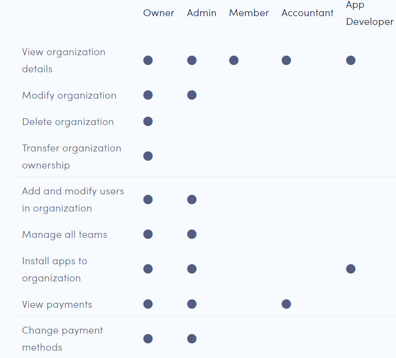

# Organization roles

All users are members of at least one organization and one team. Each user's organization and team roles determine the permissions that the user has.

The following table describes the permissions associated with each organizational role.

<figure><figcaption></figcaption></figure>

